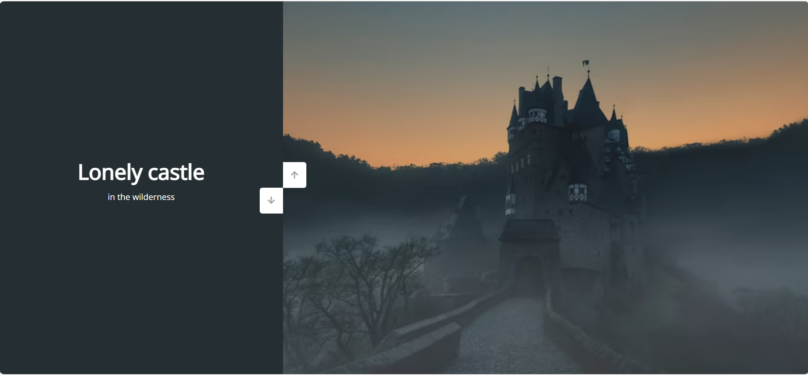
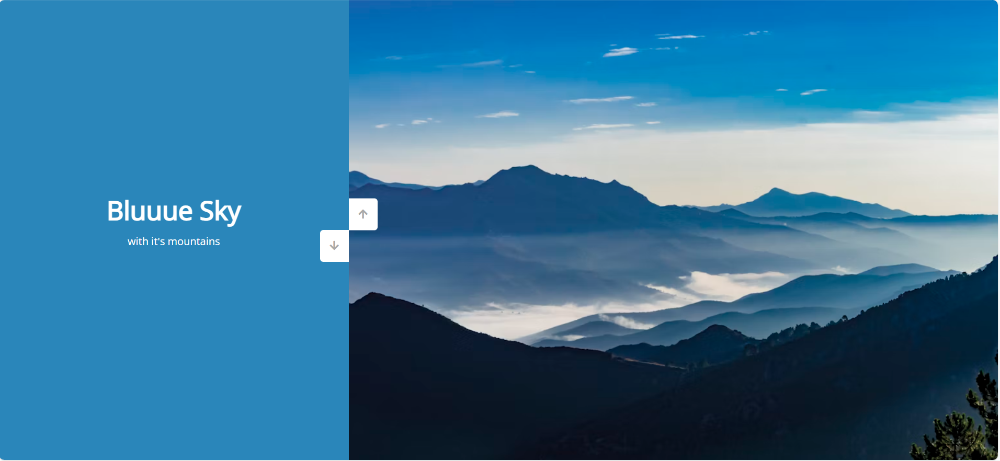
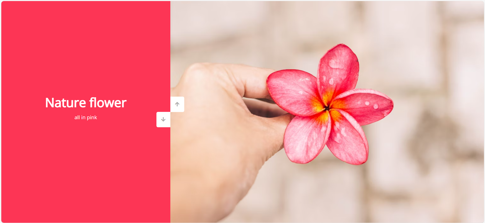

# Smooth Vertical Slider 🎢

A simple and visually appealing vertical slider built with HTML, CSS, and JavaScript. This project allows users to navigate through multiple slides with smooth transitions.

---

## ✨**Features**
- **Vertical Sliding**: Navigate through slides with a smooth scrolling effect.
- **Dynamic Backgrounds**: Each slide has unique colors and images.
- **Responsive Design**: Ensures a consistent look on all screen sizes.
- **Interactive Buttons**: Up and down buttons for easy navigation.

---

🛠️ **Technologies Used** :

**HTML5**: For structuring the slider content.
**CSS3**: For styling and animations.
**JavaScript**: For dynamic interactions and transitions.

---

📁 **Project Structure**
```
.
|-- index.html      # Main HTML structure
|-- style.css       # Styles for the slider
|-- script.js       # JavaScript logic for functionality
```

---

## Setup Instructions

1. **Clone the Repository**:
   ```bash
   git clone https://github.com/Saisrikar-Kokku/Smooth-Vertical-Slider.git
   ```

2. **Navigate to the Project Directory**:
   ```bash
   cd smooth-vertical-slider
   ```

3. **Open the Project**:
   Open `index.html` in any modern browser to view the slider.

---

## Usage
- Click the **Up** or **Down** buttons to navigate between slides.
- Each slide showcases a unique image and text.

---

## Customization
To personalize the slider:
- **Update Images**: Replace image URLs in `index.html`.
- **Change Colors**: Modify background colors in the `.left-slide` section of `index.html` or `style.css`.
- **Add More Slides**: Add new `<div>` elements to both `.left-slide` and `.right-slide` in `index.html`.


---

## Screenshots






---

📚 **What I Learned** :

Implementing smooth animations for a better user experience.
Structuring projects with a clear separation of HTML, CSS, and JavaScript.
Improving responsiveness and interactivity using CSS transitions and JavaScript event handling.

---

🧑‍💻 **Future Enhancements**
Add mobile responsiveness for smaller screens.
Implement swipe gestures for touch devices.
Add more customization options for users, such as color themes or content types.

---

## Contributing
Contributions are welcome! If you find a bug or have a feature request, feel free to open an issue or submit a pull request.

---

## License
This project is licensed you can Fort and use as well

---

## Acknowledgements
- [Font Awesome](https://fontawesome.com) for the button icons.
- [Unsplash](https://unsplash.com) for the stunning images used in the slider.

**🏫 About Me**

**Saisrikar-Kokku** : I am a 2nd-year BTech student with a keen interest in data visualization and analytics. Through this project, I aim to enhance my web development skills and explore interactive design techniques that align with my passion for creating engaging user experiences.
**Profile** : https://github.com/Saisrikar-Kokku
**Email** : Saisrikarkokku7674@gmail.com


